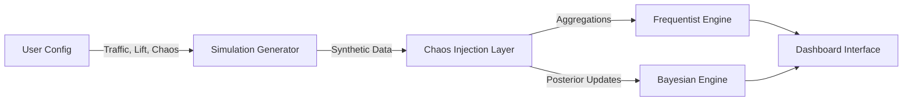

# 🧪 AB Decision Engine: A Training Simulator for Product Managers

**A robust A/B testing simulator to train decision-making in complex and noisy statistical environments**

[](https://www.python.org/)
[](https://streamlit.io/)
[](https://ab-decision-engine.streamlit.app/)
[](LICENSE)

## 🎮 Interactive Demo

**Try the Live Simulator:** [AB Decision Engine v2](https://ab-decision-engine.streamlit.app/)

Experience the full "Hostile Environment" simulation, running real-time A/B tests with chaos injection (SRM, Simpson's Paradox) directly in your browser.

## 📋 Overview

In the real world, A/B tests aren't just about formulas; they're about **data integrity** and **risk management**. This engine processes synthetic traffic generation to allow users to practice detecting validity issues before they cost the company money.

**Key Features:**
- 🌪️ **Chaos Engineering**: Injection of Sample Ratio Mismatch (SRM) and Simpson's Paradox.
- 📊 **Dual Engine**: Frequentist (Z-Test/T-Test) and Bayesian (Beta-Bernoulli/Bootstrap) analysis types.
- 📈 **Advanced Analytics**: Zero-Inflated Lognormal Revenue models and Sequential Testing boundaries.
- 🛡️ **Risk Management**: Confidence Intervals and Post-Hoc diagnostics.

## 🏗️ Architecture



### Data Flow

1. **Generation**: Synthetic traffic creation with configurable baselines and lift.
2. **Chaos Injection**: Optional application of SRM bias (e.g., 30/70 split) or Simpson's confounding (Device mixing).
3. **Analysis**: Parallel processing of data through Z-Tests, Welch's T-Tests, and Bayesian Monte Carlo simulations.
4. **Visualization**: Rendering of real-time cumulative trends and posterior distributions.

## 📚 Scientific Background

This project implements rigorous statistical methods to validate decision making:

**Frequentist Approaches**:
- **Z-Test for Proportions**: Standard significance testing for Conversion Rates.
- **Welch's T-Test**: Robust testing for continuous Recall/Revenue data, handling unequal variances.
- **Sequential Testing**: Implements **O'Brien-Fleming** boundaries for continuous monitoring without inflating False Positive Rates.
- **Confidence Intervals**: 95% CI visualization to assess uncertainty and true lift range.

**Bayesian Approaches**:
- **Beta-Bernoulli Conjugate Priors**: Models conversion probability distributions to answer "What is the probability B is better than A?".
- **Bootstrap Analysis**: Non-parametric resampling for Revenue/RPV expected loss estimation.

**Diagnostic Metrics**:
- **Average Order Value (AOV)**: Breaks down Revenue into "Conversion vs. Basket Size" to understand *why* you are winning (more users or bigger spenders).

## ⚡ System Performance

**Validated Capabilities (Monte Carlo Simulation, N=500):**

| Metric | Benchmark Result | Interpretation |
| :--- | :--- | :--- |
| **SRM Detection Sensitivity** | **100.0%** | The engine identifies 100% of sample ratio mismatches (30/70 split) at $p < 0.01$. |
| **Sequential Efficiency** | **41.8% Faster** | Decision time reduced from 14 days to **~8.2 days** on average for high-lift winners (+20%). |
| **Paradox Identification** | **Verified** | Successfully identifies "Simpson's Reversal" (Global Winner != Segment Winner) in complex traffic mixes. |

## 🌪️ Chaos Engineering Modules

### Data Integrity Stress Tests
*   **Sample Ratio Mismatch (SRM):** Simulates a broken randomization mechanism (e.g., 30/70 split). The engine uses Chi-Square Goodness of Fit to detect this validity threat.
*   **Simpson's Paradox:** Introduces a confounding variable ("Device") to invert results. Tries to trick the user into trusting global means when segment data tells a different story.
*   **Skewed Data Distrubutions:** Models Revenue using **Zero-Inflated Lognormal** distributions, challenging standard normal assumptions.

## 🚀 Quick Start

### Prerequisites
*   Python 3.12+
*   Git

### 1. Installation

```bash
# Clone the repository
git clone https://github.com/your-username/ab-decision-engine.git
cd ab-decision-engine

# Create virtual environment (Recommended)
python -m venv .venv

# Activate environment
# Windows: .\.venv\Scripts\activate
# Mac/Linux: source .venv/bin/activate

# Install dependencies
pip install -r requirements.txt
```

### 2. Usage

```bash
streamlit run app.py
```

Open your browser at `http://localhost:8501`.

## 🧪 Educational Scenarios

**Designed to train Product Managers in detecting common pitfalls:**

1.  **The "Happy Path":** Set traffic to 10k, Lift to 10%. Observe alignment between Frequentist and Bayesian results.
2.  **The "Hidden Trap" (Simpson's Paradox):** Turn on **Simpson's Paradox**. Observe Group A winning globally, while Group B wins in every individual segment.
3.  **The "False Start" (SRM):** Turn on **SRM**. Validate that the dashboard alerts on the validity compromise.
4.  **The "Money Game":** Switch Metric to **Revenue (RPV)** and observe the impact of high variance on time-to-significance.

## 📂 Project Structure

| File | Description |
| :--- | :--- |
| `app.py` | Main Streamlit dashboard application logic. |
| `generator.py` | Engine for synthetic data generation and chaos injection. |
| `stats.py` | Statistical library (Frequentist, Bayesian, Sequential). |
| `requirements.txt` | Project dependencies. |

## 🧮 Tech Stack

*   **Logic:** Python 3.12, NumPy, SciPy
*   **Visualization:** Plotly Express & GraphObjects
*   **Interface:** Streamlit
*   **Data:** Pandas

## 📝 License

This project is licensed under the MIT License.


## 👤 Author

**Name**: Jill Palma Garro  
**GitHub**: [@jpalmagarro](https://github.com/jpalmagarro)  
**LinkedIn**: [jpalmagarro](https://www.linkedin.com/in/jpalmagarro/)
